# VS Code Debbugging Environment for Python
This is a guide to help you setup the VS Code debugging environment for Python locally and remotely, and is based on VS Code's documents on [debugging](https://code.visualstudio.com/docs/editor/debugging) and [Python debug configuration](https://code.visualstudio.com/docs/python/debugging).

## Install VS Code
You can download VS Code [here](https://code.visualstudio.com/).

## Setup debugging configuration for Python
Click on the debug icon in the sidebar.


If you don't have any configuration yet, you will see "No Configurations". Click on the setting icon to create one.

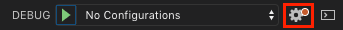

A configuration menu will then show up, choose **Python File**.

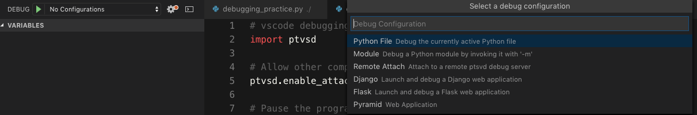

This will create and open a `launch.json` file with default configuration located in a `.vscode` folder in your workspace (project root folder). You can modify or add custom configurations here. For more configuration options, checkout the [VS Code document](https://code.visualstudio.com/docs/python/debugging#_set-configuration-options).

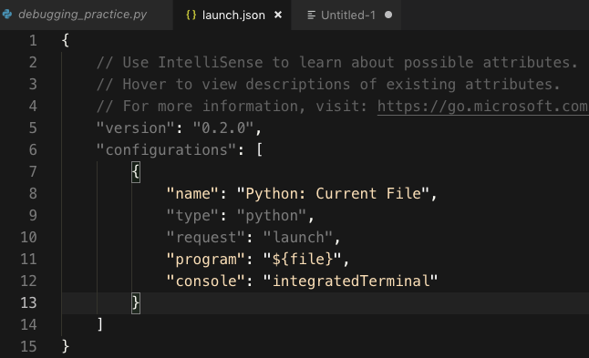

## Launch versus Attach configuration
In VS Code, there are two ways to perform debugging actions, **Launch** and **Attach**. You may think of **launching** is to start your program in debug mode, and **attaching** is to attach the VS Code debugger to an **already** running process.

You may choose the way you prefer by setting the `"request"` argument to `"launch"` or `"attach"` in `launch.json`.

## Launching a program in debug mode
With default configuration, you can launch a Python program locally in debug mode. Simply press `F5` to enter debug mode. The status bar below will turn orange and show the active launch configuration once you successfully enter debug mode.

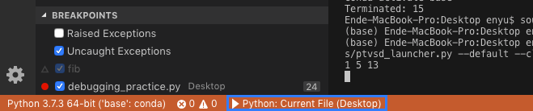

The debug toolbar will also show up for you to perform debug actions.

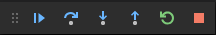

### Breakpoints
Breakpoints could be set by clicking on the **editor margin** or pressing `F9` on the current line. You may also call `breakpoint()` at any place in your Python code to pause the debugger.

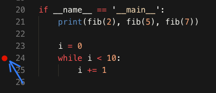

You can have more control of the breakpoints in Debug view's **BREAKPOINTS** section.

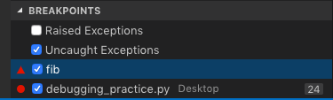

For advanced breakpoints such as conditional breakpoints, inline breakpoints or function breakpoints, checkout [VS Code document](https://code.visualstudio.com/docs/editor/debugging#_advanced-breakpoint-topics).

### Data inspection
Variables can be inspected in the **VARIABLES** section, and variables can be modified with the **Set Value** action by right clicking on the variables. Note that the variable values are relative to the selected stack frame in the **CALL STACK** section.

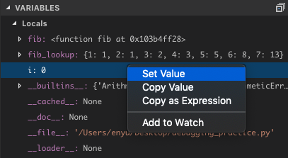

You can also add variables or **expressions** to the **WATCH** section.

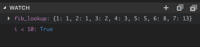

## Remote debugging over ssh
VS Code's remote debugging feature allows you to step through codes on a remote computer, and it's not nessesarily to install VS Code on the remote computer. In order to make secure connections while debugging, we use **SSH tunnel** and **port forwarding** here.

Below are the steps to remotely debug using VS Code:
1. For both computers
    1. Contains **identical** source code
    2. Install `ptvsd` using one of the command below
        ```
        conda install -c conda-forge ptvsd
        conda install -c conda-forge/label/gcc7 ptvsd
        python -m pip install --upgrade ptvsd
        ```
2. Remote computer
    1. Enable port forwarding by opening the `sshd_config` config file (found under `/etc/ssh/` on Linux and under `%programfiles(x86)%/openssh/etc` on Windows) and adding or modifying the following setting:
        ```
        AllowTcpForwarding yes
        ```
    2. Restart the SSH server. On Linux/macOS, run `sudo service ssh restart`. On Windows, run `services.msc`, locate and select OpenSSH or `sshd` in the list of services, and select **Restart**.
    3. In the source code, add the following codes. The IP address is set to `localhost` since we connect through **SSH tunnel** and `3000` is the port number you would like to use.
        ```python
        import ptvsd

        # Allow other computers to attach to ptvsd at this IP address and port.
        ptvsd.enable_attach(address=('localhost', 3000), redirect_output=True)

        # Pause the program until a remote debugger is attached
        ptvsd.wait_for_attach()
        ```
    4. Launch the remote process through ptvsd
        ```
        python -m ptvsd --host localhost --port 3000 --wait debug.py
        ```
        This starts the script `debug.py` using `python`, with the remote computer as the host and listening on port `3000`. The program will be paused until the debugger attaches.
3. Local computer
    1. Create an SSH tunnel by running:
        ```
        ssh -L sourceport:localhost:destinationport user@remoteaddress
        ```
        using a selected port for `destinationport` and the appropriate username and the remote computer's IP address in `user@remoteaddress`. For example, to use port `3000` on IP address `1.2.3.4`, the command would be:
        ```
        ssh -L 3000:localhost:3000 user@1.2.3.4
        ```
    2. Add the commented lines of the codes that were added to the remote computer. Adding these lines ensures that the code on both computers matches line by line.
        ```python
        #import ptvsd

        # Allow other computers to attach to ptvsd at this IP address and port.
        #ptvsd.enable_attach(address=('localhost', 3000), redirect_output=True)

        # Pause the program until a remote debugger is attached
        #ptvsd.wait_for_attach()
        ```
    3. Open `launch.json` and add the following configuration to the array in `"configuration"`. Modify `"remoteRoot"` to the directory on the remote computer containg the source code, and modify `"port"` and `"host"` to match the ones in `ptvsd.enable_attach` added to the source code.
        ```javascript
        {
            "name": "Python Attach (Remote Debug)",
            "type": "python",
            "request": "attach",
            "pathMappings": [
                {
                    "localRoot": "${workspaceFolder}",  // You may also manually specify the directory containing your source code.
                    "remoteRoot": "."       // Linux example; adjust as necessary for your OS and situation.
                }
            ],
            "port": 3000,                   // Set to the remote port.
            "host": "localhost"             // Set to your remote host's public IP address.
        }
        ```
    4. Set some breakpoints **locally** and start debugging using the remote debug configuration. Now you should be stopped on the locally set breakpoints, and are able to step into codes, examine varialbes, and perform all other debugging actions. Expressions that you enter in the **Debug Console** are run on the remote computer as well.

## Known issues with multiprocessing
Unfortunately, VS Code debugger does not support `fork` at this moment, hence you may encounter some errors using functions from `multiprocessing` or other functions that uses `fork`. A possible workaround for Python3 is to use `spawn` instead of `fork` by adding the following lines before using anything from `multiprocessing`. Also add `"subProcess": true` to your `launch.json` (for more information, checkout [#943](https://github.com/microsoft/ptvsd/issues/943)). But unfortunately, this did not work for me😭
```python
import multiprocessing
multiprocessing.set_start_method('spawn', force=True)
```
Note that using `spawn` may consume more memory and may thus cause problems so beware! (for more detailed explanation please refer to [#943](https://github.com/microsoft/ptvsd/issues/943#issuecomment-481148979) as well)

## Debugging Practices with DSB2018 tran.py and valid.py
As previously described, VS Code debugger does not support `fork` in the meanwhile, hence the `multiprocessing.Manager()` and `DataLoader` from `torch.utils.data` will cause erros when debugging. One possible workaround is to disable multiprocessing when debugging, and make sure that everything else is working fine, then we can add them back when running.

So, you will need to disable the use of `Manager()` and set `cache` to `None`, since we're not using multiple workers while debugging, there's no need for the IPC manager.

Also, to disable `forking` in `DataLoader`, set `n_worker = 0` in `config.ini`, which will make `DataLoader` to load data in the main process.

After the above steps, we should be good to go, however, an error `"failed to launch debugger for child process"` will still occur which is caused by `train_test_split` from `sklearn.model_selection` because it uses `multiprocessing` as well. But that seems to not cause any issue, we can still train the model and the train/valid dataset is splitted as well.

## Debugging with PyTorch
We use TensorBoard to track our training metrics and visualize graphs, and we need [tensorboardX](https://github.com/lanpa/tensorboardX) for PyTorch to work with TensorBoard.
```
pip install tensorflow tensorboard tensorboardX
```
Start your Python script and use TensorBaord with `tensorboard --logdir <logging_directory>`. A url address to TensorBoard will show up in the console, and you may use `ssh tunnel` and `port forwarding` for remote access. The default `port` for TensorBoard is `:6006` by the way.

Start logging things to tensorboard by:
```python
from tensorboardX import SummaryWriter
with SummaryWriter(log_dir) as writer:
    # your code here
```

### Visualizing graphs
We could visualize our model graph to check if there's any miswiring, or have a better view of the model's forward path. This could be done by adding the following lines:
```python
device = torch.device("cuda" if torch.cuda.is_available() else "cpu")
dummy_input = torch.rand(n_batch, 3, width, width, device=device)
writer.add_graph(model, dummy_input)
```
Note that you may see an error
```
RuntimeError: ONNX symbolic expected a constant value in the trace
```
occur if you use **upsampling** layers like `nn.ConvTranspose2d` in your network. According to [#10942](https://github.com/pytorch/pytorch/issues/10942), this is because ONNX statically determines the kernel size. One way to resolve this is to manually set the input and output sizes of these layers to constants.

You can checkout your graph in TensorBoard, which will look like this:
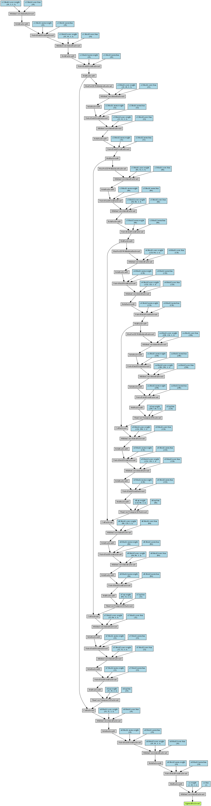

You can click on blocks or nodes to expend them and learn more details
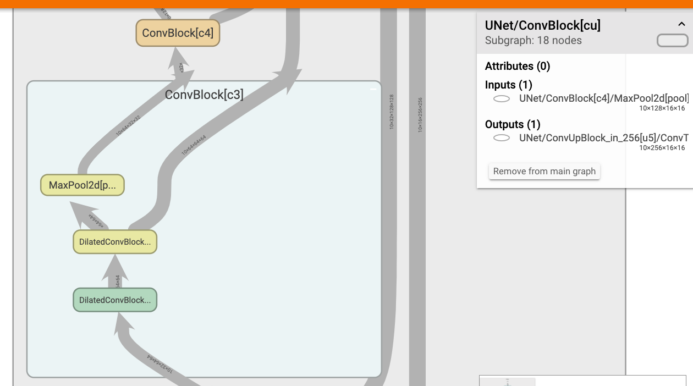

#### Export as ONNX model
To export the model as an ONNX (Open Neural Network Exchange format) model, install the prerequisites and include the lines below in your code.
```
sudo apt-get install libprotobuf-dev protobuf-compiler
pip install onnx
```
```python
torch.onnx.export(model, (dummy_input,), "checkpoint/model.pb", verbose=False)
writer.add_onnx_graph("checkpoint/model.pb")
```
This will export your model to a .pb file and log the model graph to TensorBoard.

### Logging scalars
You can add scalars you want to inspect to TensorBoard by something like:
```python
writer.add_scalar('training/epoch_loss', loss, epoch)
```
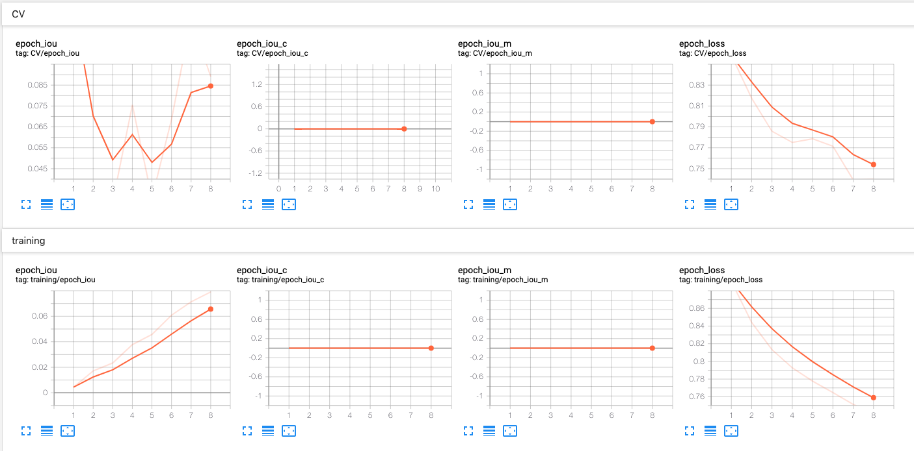

### Logging images
You can add images such as the inputs and outputs to TensorBoard to see their changes through epochs.
```python
writer.add_images('validating/inputs', inputs, epoch)
writer.add_images('validating/outputs', outputs.repeat(1,3,1,1), epoch)
```
Note that `add_images` requires **RGB** images, so if your images are grayscale or 1-channel, you may use `repeat(1, 3, 1, 1)` to stack the image 3 times to make it 3-channel. (in this case the RGB channel is at "column 1" starting from "column 0") You can toggle the orange bar to see images at differnet epochs, make sure you log the same batch of images to TensorBoard if you want to track their changes through epochs.
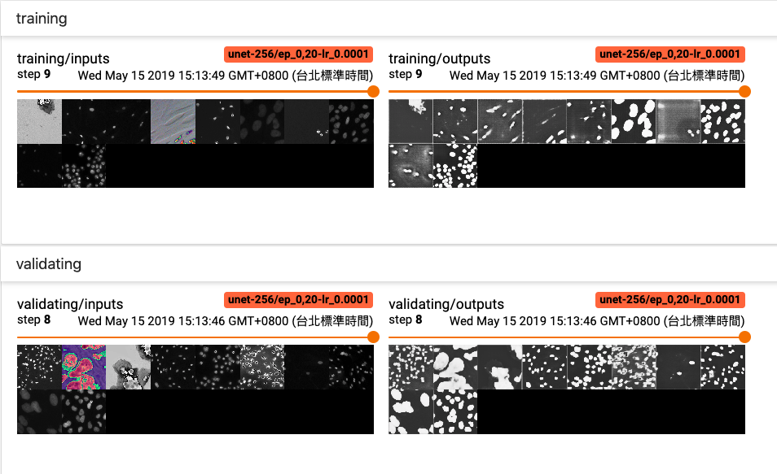

### Tracking PyTorch tensors and backpropagation
For instance, if you want to check whether the first convolutional layer of your network is properly propagated or the gradient vanished, or maybe you want to check the backpropagation path of the network to see if anything went wrong, then you may use VS Code debugger's **watch list** to add variables or objects you would like to trace.

#### Examples
1. Checking the weights of a layer after the model's parameters are updated
    Here we want to see how the weights of the first convolutional layer of our network, which is `model.c1.block.conv.weight`, change after an update, we simply add it to our watch list, and add breakpoints before and after the update.
    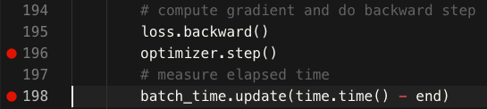
    
    Execute the code in debug mode and add `model.c1.block.conv.weight` to the watch list, and we can see all of its attributes. Now we're at the breakpoint before the update, and let's check if the weights are correctly updated after `optimizer.step()`.
    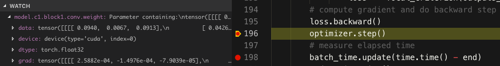
    
    After the update, we can see that the `data` part is highlighted which indicates that it has been changed since the last breakpoint.
    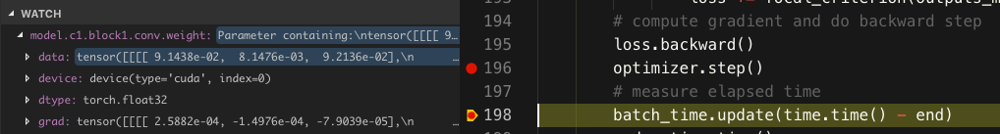
    
    Let's do some simple math to verify the correctness of the update! The optimizer we use in this case is `SGD` for simplicity and the `learning rate` is set to `10` so we can see significant changes in the weights.
       
    
2. 
