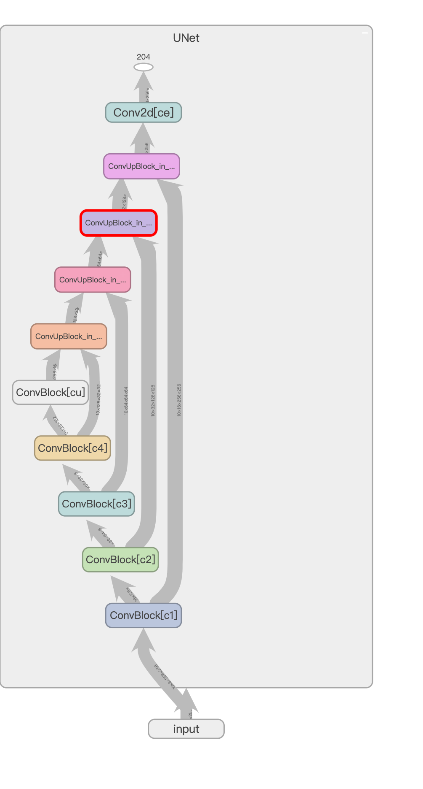
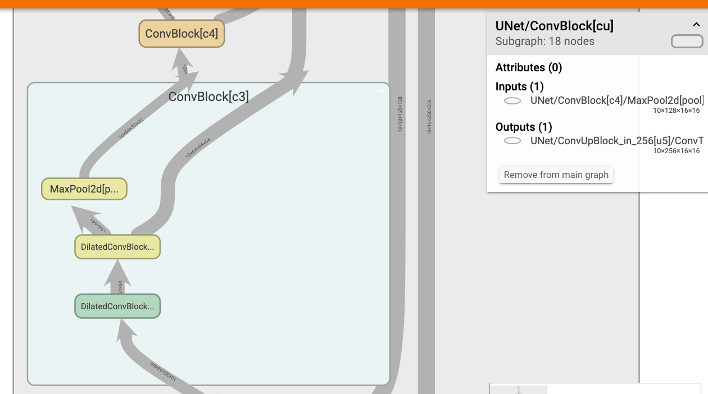
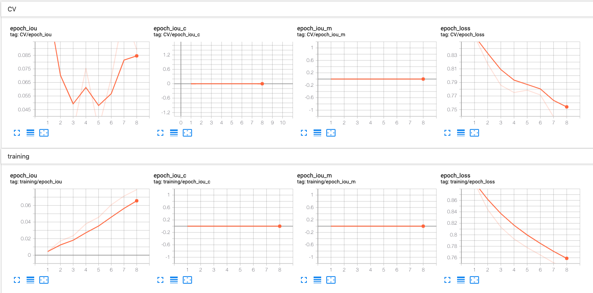
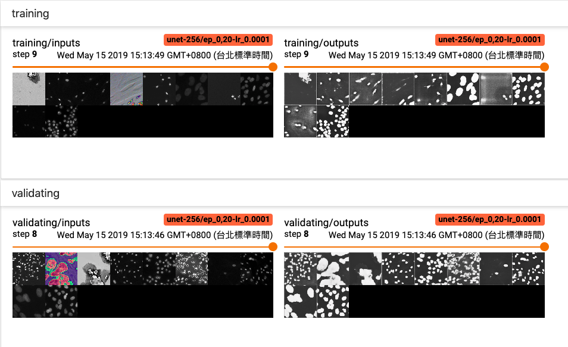
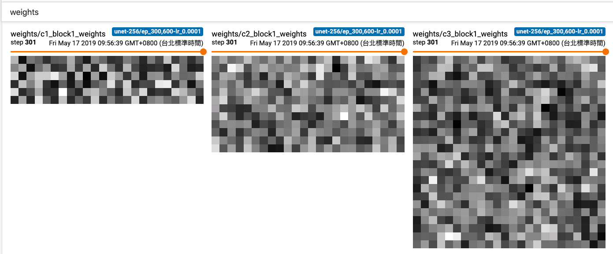
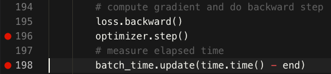
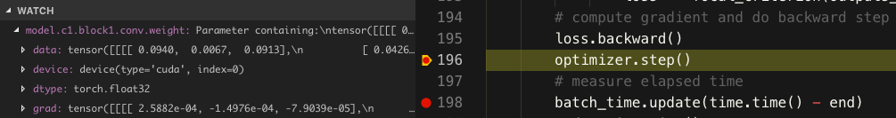
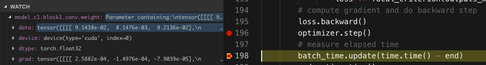
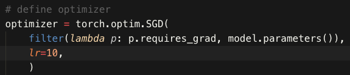

# Debugging with PyTorch
We use TensorBoard to track our training metrics and visualize graphs, and we need [tensorboardX](https://github.com/lanpa/tensorboardX) for PyTorch to work with TensorBoard.
```
pip install tensorflow tensorboard tensorboardX
```
Start your Python script and use TensorBaord with `tensorboard --logdir <logging_directory>`. A url address to TensorBoard will show up in the console, and you may use `ssh tunnel` and `port forwarding` for remote access. The default `port` for TensorBoard is `:6006` by the way.

Start logging things to tensorboard by:
```python
from tensorboardX import SummaryWriter
with SummaryWriter(log_dir) as writer:
    # your code here
```

## Visualizing graphs
We could visualize our model graph to check if there's any miswiring, or have a better view of the model's forward path. This could be done by adding the following lines:
```python
device = torch.device("cuda" if torch.cuda.is_available() else "cpu")
dummy_input = torch.rand(n_batch, 3, width, width, device=device)
writer.add_graph(model, dummy_input)
```
Note that you may see an error
```
RuntimeError: ONNX symbolic expected a constant value in the trace
```
occur if you use **upsampling** layers like `nn.ConvTranspose2d` in your network. According to [#10942](https://github.com/pytorch/pytorch/issues/10942), this is because ONNX statically determines the kernel size. One way to resolve this is to manually set the input and output sizes of these layers to constants.

You can checkout your graph in TensorBoard, which will look like this:


You can click on blocks or nodes to expand them and learn more details


### Export as ONNX models
To export the model as an ONNX (Open Neural Network Exchange format) model, install the prerequisites and include the lines below in your code.
```
sudo apt-get install libprotobuf-dev protobuf-compiler
pip install onnx
```
```python
torch.onnx.export(model, (dummy_input,), "checkpoint/model.pb", verbose=False)
writer.add_onnx_graph("checkpoint/model.pb")
```
This will export your model to a .pb file and log the model graph to TensorBoard.

## Logging scalars
You can add scalars you want to inspect to TensorBoard by something like:
```python
writer.add_scalar('training/epoch_loss', loss, epoch)
```


## Logging images
You can add images such as the inputs and outputs, model parameters, or outputs of the hidden layers to TensorBoard to see their changes through epochs. For example:
```python
writer.add_images('validating/inputs', inputs, epoch)
writer.add_images('validating/outputs', outputs.repeat(1, 3, 1, 1), epoch)
writer.add_images('weights/c2_block1_weights', model.c2.block1.conv.weight[:, :1, :, :].repeat(1, 3, 1, 1), epoch)
writer.add_images('hidden/u7_output', model.u7_out[:, :1, :, :].repeat(1, 3, 1, 1), epoch)
```
Note that `add_images` requires **RGB** images, so if your images are grayscale or 1-channel, you may use `repeat(1, 3, 1, 1)` to stack the image 3 times to make it 3-channel. (in this case the RGB channel is at "column 1" starting from "column 0") You can toggle the orange bar to see images at differnet epochs, make sure you log the same batch of images to TensorBoard if you want to track their changes through epochs.






## Tracking PyTorch tensors and backpropagation
For instance, if you want to check whether the first convolutional layer of your network is properly propagated or the gradient vanished, or maybe you want to check the backpropagation path of the network to see if anything went wrong, then you may use VS Code debugger's **watch list** to add variables or objects you would like to trace.

### Examples
1. Checking the weights of a layer after the model's parameters are updated

    Here we want to see how the weights of the first convolutional layer of our network, which is `model.c1.block.conv.weight`, change after an update. We simply add it to our watch list, and add breakpoints before and after the update.
    
    
    
    Execute the code in debug mode and add `model.c1.block.conv.weight` to the watch list, and we can see all of its attributes. Now we're at the breakpoint before the update, let's check if the weights are correctly updated after `optimizer.step()`.
    
    
    After the update, the `data` part is highlighted which indicates that it has been changed since the last breakpoint.
    
    
    Let's do some simple math to verify the correctness of the update! The optimizer we use in this case is `SGD` for simplicity and the `learning rate` is set to `10` so we can see significant changes in the weights.
    
    
    We can verify by calculating: <a href="https://www.codecogs.com/eqnedit.php?latex=w_{new}=w_{old}-{lr}*grad" target="_blank"></a>
    ```python
    [9.1438e-02, 8.1476e-03, 9.2136e-02] = [0.094, 0.0067, 0.0913] - 10 * [2.5882e-04, -1.4976e-04, -7.9039e-05]
    ```
    Which is basically correct!
2. Tracking the backpropagation route
    
    If you're interested in the backpropagation route of `loss`, you can add it to the **watch list** and trace the whole path through `loss.grad_fn.next_functions` and `loss.grad_fn.next_functions[0][0].next_functions` and so on..., which may look like something like this:
    
    
    As we know that `Sigmoid` is the last layer of our model, the calculations that come before `Sigmoid` are the process of computing the loss, you may keep go on and trace the model backwards if you wanted to.
